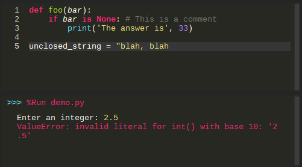

# Monakai for [Thonny](https://thonny.org)

> A dark theme for [Thonny](https://thonny.org)

## Install

#### From Thonny

1. Go to `Thonny -> Tools -> Manage plug-ins`
2. Search for `thonny-monokai`
3. Click `install`

#### Using pip

    $ pip install thonny-monokai

#### Manual Installation

1. Download using the [GitHub .zip download](https://github.com/rodneybbjr/thonny-monokai/archive/refs/heads/main.zip) and unzip them.
2. Go to `Thonny -> Tools -> Manage plug-ins...`
3. Click `Install from local file`
4. Find and select the preferred compressed file under `dist/` folder.

#### Activate Theme

1. After installing, close and open Thonny, so the theme is loaded
2. Go to `Thonny → Tools → Options`
3. Under `Theme & Font`, select the drop-down menu `Syntax theme`
4. Select `Monokai`

## License

[MIT License](./LICENSE)
